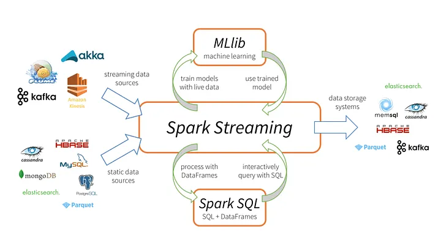
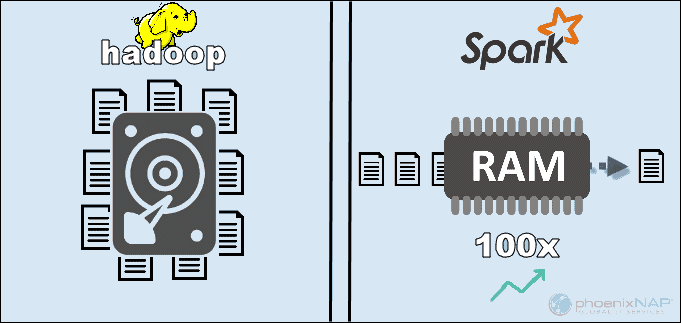

É uma engine de processamento em ambiente distribuído

Imagine vários **clusters** de computadores trabalhando juntos de forma interconectada e distribuindo seu conjunto de trabalho nestas máquinas, com sua CPU e memória compartilhadas com o objetivo de aumentar seu processamento ou disponibilidade do ambiente, resultando em uma ótima escalabilidade

Usando somente uma máquina, você se limita aos recursos computacionais, o poder de processamento daquela única máquina

É possível usar o framework do Spark para acessar vários tipos de bancos de dados, em batch e em streaming, com Python até Java, sendo extremamente versátil

Diferente do Hadoop, o Spark não trabalha fazendo o processamento em disco, mas sim em memória, aumetando ainda mais o tempo de processamento

Mas o Hadoop ainda é bastante usado por ter seu file system compartilhado com o HDFS, apesar de seu uso ser mais difícil e somente possuir processamento em batch

