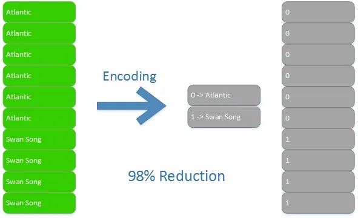
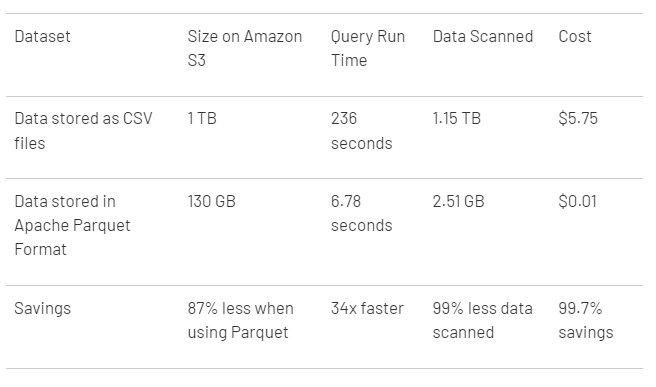

## O que é

É uma engine de processamento em ambiente distribuído

Imagine vários **clusters** de computadores trabalhando juntos de forma interconectada e distribuindo seu conjunto de trabalho em vários nós nestas máquinas, com sua CPU e memória compartilhadas com o objetivo de aumentar seu processamento ou disponibilidade do ambiente, resultando em uma ótima escalabilidade

Usando somente uma máquina, você se limita aos recursos computacionais, o poder de processamento daquela única máquina

É possível usar o framework do Spark para acessar vários tipos de bancos de dados, em batch e em streaming, com Python até Java, sendo ele extremamente versátil

[](https://medium.com/thefreshwrites/introduction-to-spark-architecture-fadc9829d3f5)

<br>

## Spark vs outras ferramentas

Diferente do Hadoop, o Spark não trabalha fazendo o processamento em disco, mas sim em memória, aumetando ainda mais o tempo de processamento

Mas o Hadoop ainda é bastante usado por ter seu file system compartilhado com o HDFS, apesar de seu uso ser mais difícil e somente possuir processamento em batch

[](https://phoenixnap.com/kb/hadoop-vs-spark)

Os dados processados pelo Pandas, os dataframes, ficam alocados em uma memória standalone, diferete do Spark que o faz na memória de várias máquinas, tanto em leitura, quanto em escrita

<br>

## A dupla Apache Pyspark e **Parquet**

Formato de dados desenvolvido de forma otimizada a trabalhar com BigData, armazenando seus dados em formato de coluna, os comprimindo, codificando, e criando partições físicas, desenvolvido pela Apache

[](https://towardsdatascience.com/demystifying-the-parquet-file-format-13adb0206705)

A consulta é então otimizada pois os tipos de dados estão próximos, e não embaralhados, além de seu armazenamento ser drasticamente reduzido por substituição de redundância, ganhando espaço em disco e tempo de processamento

[](https://naderasadi.medium.com/what-is-apache-parquet-94f73d645588)

Essa diferença de performance é imperativa, ainda mais em cloud que o custo é por tempo de processamento, ciclo de CPU e armazenamento em disco

[](https://www.linkedin.com/pulse/difference-between-parquet-csv-emad-yowakim/)

<br>

## Meu primeiro Pyspark

Será usado o Databricks Comunnity, criar conta lá portanto, e como exemplo a base de dados **train.csv** do Kaggle: [Housing Prices](https://www.kaggle.com/competitions/home-data-for-ml-course/data?select=train.csv)

Deverá ser feito o upload do arquivo ou pela aba **Catalog -> Create Table**, ou já no arquivo .dbc do Databricks, com **File -> Upload data to DBFS...**

`````py linenums="1"
# Localização do arquivo e seu tipo
file_location = "/FileStore/tables/train.csv"
file_type = "csv"

# Opções do CSV
infer_schema = "false"
first_row_is_header = "true"
delimiter = ","

# O padrão de código Spark para CSV, outros tipos desconsiderar
df = spark.read.format(file_type) \
    .option("inferSchema", infer_schema) \
    .option("header", first_row_is_header) \
    .option("sep", delimiter) \
    .load(file_location)
`````

A opção `header` determinará a primeira linha do dataset como sendo o cabeçalho

A opção `inferSchema` fará a inferência dos tipos de dados das colunas automaticamente, fazendo com que seja implementado outro Spark Job somente para este trabalho, deixando este processo inicial um pouco mais lento

Caso opte por passar os tipos das colunas manualmente, ganhando tempo de processamento, é possível utilizar somente a opção `schema`

```py linenums="1"
from pyspark.sql.types import StringType, DoubleType # (1)!

customSchema = StructType(Array(
    StructField("IDGC", StringType, True),        
    StructField("SEARCHNAME", StringType, True),
    StructField("PRICE", DoubleType, True),
    # etc...
))

df = spark.read.format(file_type) \
    .option("schema", customSchema) \
    .option("header", first_row_is_header) \
    .option("sep", delimiter) \
    .load(file_location)

```

1. Para saber mais dos tipos de dados: <https://spark.apache.org/docs/latest/sql-ref-datatypes.html>

É possível acompanhar o processo do cluster Spark na aba **Compute -> Spark UI**

Qualquer comando do Spark, mesmo feito em Python, é considerado um código SQL, logo, uma query

Para traduzir o dataframe, seja formato xlsc ou csv, para o formato parquet, faz-se da seguinte forma (pode demorar um pouco devido a escrita dos metadados):

```py linenums="1"
df.write.format("parquet")\
.mode("overwrite")\
.save("/FileStore/tables/processing/df-parquet-file.parquet")
```

O modo `overwrite` identifica caso haja outro arquivo parquet com o mesmo nome e o subscreve forçadamente

Para fazer a leitura:

```py linenums="1"
df_parquet = spark.read.format("parquet")\
.load("/FileStore/tables/processing/df-parquet-file.parquet")
```

<br>

## O paradigma de Performance Tuning no Spark

someday...