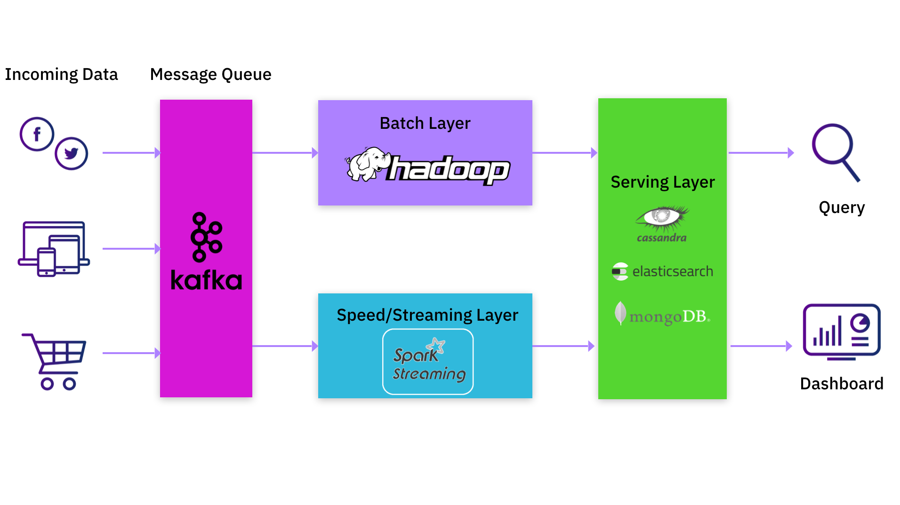
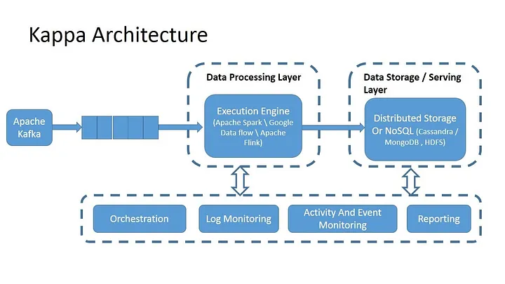
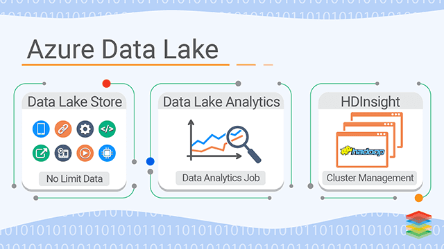
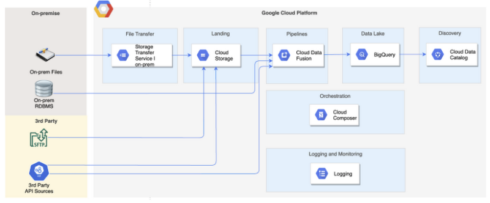
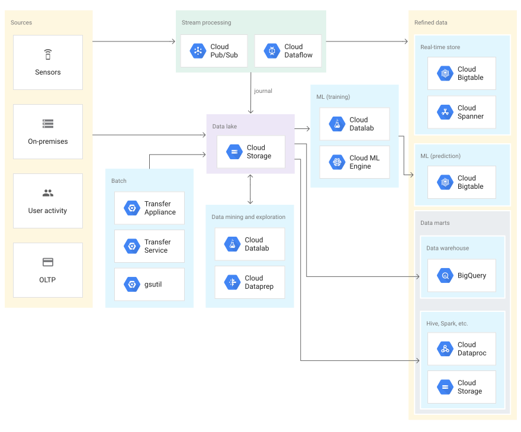

## Visão Geral

Surgidos em 2011

Não é uma tecnologia, não é um protocolo, não é um framework, é somente um conceito, algo abstrato. Outra coisa é a sua forma de se implementar 

Um repositório único para armazenar todos os formatos de dados, sendo eles estruturados, semi-estruturados e até não-estruturados

Necessário para a finalidade de testar um modelo de ML, descobrir as features do modelo, necessitando dos formatos estarem em formato padrão

Pode ser trabalhado com dados em **batch** ou em **streaming**

- **Batch**: Grande carga de dados que chegam em tantos períodos específicos de tempo, como a cada dia, cada 30 min, etc, sendo ele programado para acontecer com frequência, portanto, um processo em lote que é processado tudo de uma vez, exemplo de uso seria a arquitetura Lambda

- **Streaming**: Pequenas porções de dados que chegam em tempo real, sendo processados por funções de MapReduce para organizar os dados embaralhados, exemplo desse uso seria a arquitetura Kappa e também a Lambda

Seu objetivo é entregar rápidos insights, coma menor burocracia possível

O principal usuário é o Cientista de Dados, capaz de tratar e processar os dados não estruturados a bel prazer. Logo, fornece principalmente dados para AI e modelos de Machine Learning

O modelo de schema é definido no momento de leitura, não existindo uma tabela rígida com campos bem determinados

Deve-se ter muito cuidado para não virar um [Data Swamp](), para isso, boas práticas devem ser adotadas, como sistema de controle de acesso, controle de cotas por zona de gerenciamento, como landing zones, process zones, sendo estas, exemplos de uma arquitetura medallion ou multihop, com os dados brutos entrando na zona Bronze os pré-processados no Prata e o dado final no Ouro, estipulação da periodicidade da ingestão de dados, não armazenar dados inúteis, definição de regras de negócios, diversas fontes de dados com diversas pipelines, com fluidez de dados, garantir os metadados (os dados sobre os dados), defini etc

 

## Soluções do Mercado

Importante frizar que todas os seguintes exemplos são soluções e serviços em **cloud**

### Amazon Bucket S3

Uma solução para armazenamento de objetos, onde a partir dele, há várias outras soluções integradas para fazer a gestão dos dados

Escalável, seguro, com um custo viável

Os Buckets (repositórios) podem ter configurações de região, replicação diferentes, de tags, metadados, etc

Soluções integradas para:

- Pesquisa e Catálogo dos dados
- Ingestão de dados, com captação e coleta de dados
- Funções de segurança, como criptografias, permissões
- Interfaces de acesso de usuário
- Serviçoes de analytics

 

### Amazon Lake Formation

Solução mais especializada em Data Lakes, sendo um pouco mais completa que o S3, até podendo consumir dados do mesmo, consumindo também de umbanco de dados relacional e não relacionais também

Pode possuir soluções de crawlers, ETL e preparação de dados integrados, catalogação dos dados, configurações de segurança e controles de acesso

Podendo também integrar dentro da Amazon Athena (solução de analytics da AWS), Amazon Redshift e Amazon EMR, e etc

O armazenamento pode até ser feito dentro do Bucket S3, mas sua gestão do Data Lake seria feita dentro do Lake Formation

 

### Azure Data Lake

**Data Lake Store** provê soluções de armazenamento para dados estruturados, semi-estruturados e não-estruturados

**Data Lake Analytics** para soluções de analytics (pasme) com ampla gama de linguagens de programação como ferramentas disponíveis, tais como R, Python, C#, T-SQL e .NET

**HDInsight** para processamento distribuído, com um amplo leque de ferramentas também, como Java e Scala

 

### Google Cloud Storage

Possui serviço de armazenamento, serviços de pipelines com GC Fusion, Big Query para analytics, orquestrações com o Cloud Composer, monitoramento com Logging e Cloud Data Catalog para catalogação dos dados (pasme)

> Geralmente os dados de sensores são não estruturados ou semi-estruturados, por se tratarem de JSON

Dados gerados **on-premise**

- **Cloud**: Os serviços estão além do seu computador/servidor local, estão na nuvem, sendo gerenciados ou armazenados em um outro local de talvez uma outra empresa, sendo seu custo a exemplo de hardwares, segurança e backups diminuídos pois essa bronca está com a fornecedora da nuvem, com você pagando somente com o que consome

- **On-premise**: São os sistemas, servidores internos de uma empresa, implantações internas da TI que gerenciam toda a infraestrutura, é o local. Por exemplo, você compraria o hardware do servidor e faria a manutenção dele, onde também configuraria e atualizaria os sistemas operacionais nos quais seu software é executado, além de instalar e atualizar todos os complementos e plug-ins necessários, gastando também com parte elétrica e refrigeração, sendo sua implementação e gerenciamento de infraestrutura um tanto quanto complexos

- **SaaS Software as a Service**: Todas as responsabilidades do de cima, sendo um software como o nome sugere, passam a ser do prestador do serviço de nuvem, segurança, confidencialidade, manutenção, etc

<!-- Mais em: https://aws.amazon.com/pt/compare/the-difference-between-saas-and-on-premises/ -->

O GCP possui também serviços para dados em streaming, batch, gerenciamento do Data Lake por linha de comando com o gsutil, assim como data mining, machine learning, etc, tudo integrado ao seu sistema de armazenamento

 

## Soluções Open Source

Soluções que podem ser implementadas em seu ambiente on-premise gastando muito menos do que gastaria com uma AWS da vida por causa de suas assinaturas e planos

### Minio

Implementa o protocolo S3 da AWS, podendo ser orquestrado também com Kubernetes

Solução excelente para cloud híbrida

 

### Lake FS

Pode ser integrado também com diversas outras soluções e protocolos

Faz a gestão do versionamento do Data Lake a nível de código

 

### Hadoop File System

Famoso HDFS

Não recomendável usar somente ele pois perde soluções como sistema de controle de acesso, controle de cotas por zona, etc