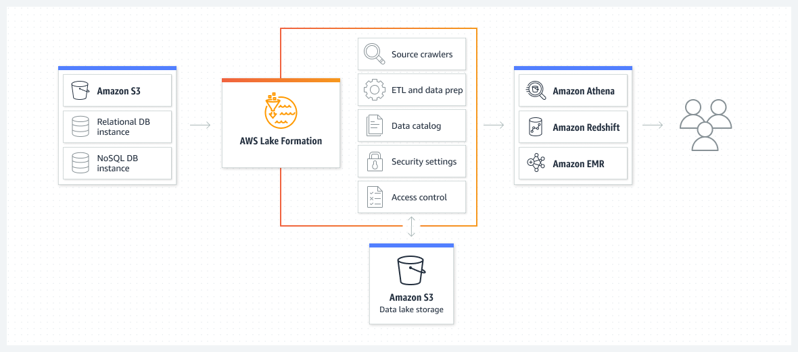

## Visão Geral

Deve-se ter muito cuidado para não virar um [Data Swamp]()

Não é uma tecnologia, não é um protocolo, não é um framework, é somente um conceito, algo abstrato. Outra coisa é a sua forma de se implementar 

Um repositório único para armazenar todos os formatos de dados, sendo eles estruturados, semi-estruturados e até não-estruturados

Pode ser trabalhado com dados em **batch** ou em **streaming**

- **Batch**: Dados que chegam em tantos períodos de tempo, como a cada dia, cada 30 min, etc, sendo ele programado para acontecer, portanto, um processo em lote

- **Streaming**: Dados que chegam em tempo real

Seu objetivo é entregar rápidos insights, coma menor burocracia possível

Os usuários podem consultar o Data Lake por meio de [Data Marts]() 

## Soluções do Mercado

### Amazon Bucket S3

Uma solução para armazenamento de objetos, onde a partir dele, há várias outras soluções integradas para fazer a gestão dos dados

Escalável, seguro, com um custo viável

Os Buckets (repositórios) podem ter configurações de região, replicação diferentes, de tags, metadados, etc

**Disponível em:** [https://www.techmango.net/data-lake-best-practices-for-aws](https://www.techmango.net/data-lake-best-practices-for-aws)

Soluções integradas para:

- Pesquisa e Catálogo dos dados
- Ingestão de dados, com captação e coleta de dados
- Funções de segurança, como criptografias, permissões
- Interfaces de acesso de usuário
- Serviçoes de analytics

### Amazon Lake Formation

**Disponível em:** [https://aws.amazon.com/pt/lake-formation/](https://aws.amazon.com/pt/lake-formation/)

Solução mais especializada em Data Lakes, sendo um pouco mais completa que o S3, até podendo consumir dados do mesmo, consumindo também de umbanco de dados relacional e não relacionais também

Pode possuir soluções de crawlers, ETL e preparação de dados integrados, catalogação dos dados, configurações de segurança e controles de acesso

Podendo também integrar dentro da Amazon Athena (solução de analytics da AWS), Amazon Redshift e Amazon EMR, e etc

O armazenamento pode até ser feito dentro do Bucket S3, mas sua gestão do Data Lake seria feita dentro do Lake Formation

### Azure Data Lake

**Disponível em:** [https://www.xenonstack.com/insights/azure-data-lake](https://www.xenonstack.com/insights/azure-data-lake)

**Data Lake Store** provê soluções de armazenamento para dados estruturados, semi-estruturados e não-estruturados

**Data Lake Analytics** para soluções de analytics (pasme) com ampla gama de linguagens de programação como ferramentas disponíveis, tais como R, Python, C#, T-SQL e .NET

**HDInsight** para processamento distribuído, com um amplo leque de ferramentas também, como Java e Scala

**Disponível em:** [https://cloud.google.com/blog/topics/developers-practitioners/architect-your-data-lake-google-cloud-data-fusion-and-composer](https://cloud.google.com/blog/topics/developers-practitioners/architect-your-data-lake-google-cloud-data-fusion-and-composer)

## Soluções Open Source