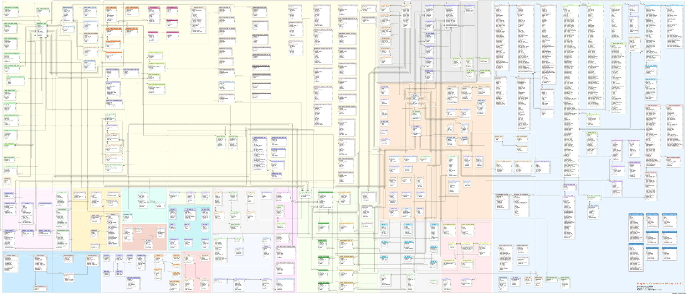
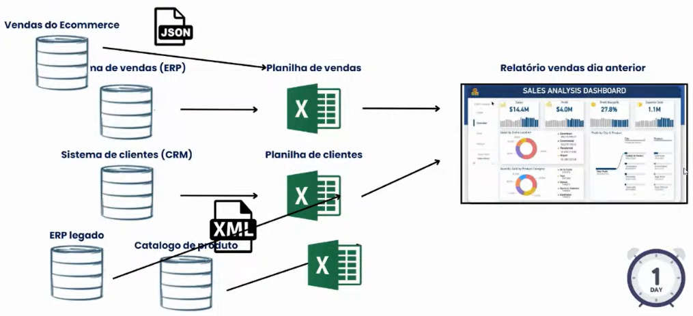

## Visão Geral

Surgidos no final da década de 80

São CAROS pois trabalham com bases de dados massivas, feitos para queries escaláveis

Diferentes dos Data Lakes, os Data Warehouses são soluções mais controladas, confiáveis e lentas, com os dados bem estruturados pelas modificações do processo de ETL

Sua principal ideia é reduzir o trabalho manual para que seja facilitado o foco nas pesquisas e consultas, reaproveitando o processamento e assim melhorando a performance para a geração de BI e relatórios. Logo, seus principais usuários são da área de BI, gestores, gerentes 

Muito utilizado devido a suas transações **ACID**

- **ACID Atomicity, Consistency, Isolation, Durability**: Uma garantia de que a transação nos bancos de dados foi bem feita, co uma transação não interferindo na outra. Ela começa e finaliza, não podendo ficar no meio (mandei 100 reais e chegou 50?)

Seus schemas são feitos no momento de escrita, sendo necessário o conhecimento das tabelas

Todos os conceitos de uma DW são válidos para a construção de uma arquitetura mais moderna como um Data Lakehouse

É melhor não fazer um DW de tudo e disponibilizar as visualizações, mas sim, disponibilizar os dados através de Data Marts

O DW não chega a ser somente uma "vitrine" do banco de dados pois dentro dele será feita a limpeza e cálculo de **KPIs** que podem até nem existir em um DM, necessitando da junção de mais de um, como por exemplo o de marketing e de produto. Não é só expôr o dado de uma maneira melhor, mas gerar ainda mais informação

- **KPI**: 

## Eu preciso? (momento storytelling)

Chega na sua empresa e pergunta pro analista quais produtos foram vendidos no dia anterior e para quais clientes estes mesmos foram vendidos, dependendo da dificuldade de responder, urge a necessidade de um DW

Já pensou participar de uma reunião com os times de vendas, cada um com um valor de quanto vendeu ontem, marketing, financeiro, comercial, etc

Para quê eu preciso disso? Não seria melhor só conectar diretamente no sistema?

###### 
Imagina conectar daqui

É um sistema transacional rápido, não foi feito para consultas analíticas

Sem um DW então, será extraído de um sistema ERP uma planilha de vendas para que então possa ser visualizado o relatório do dia anterior, fazendo gráficos, procv, etc

###### 
Diagrama de Fluxo retirado da supletiva do Data Hackers com Luciano Vasconcelos

E se precisar escalar e não ter de fazer somente com o sistema **ERP**, mas também o de **CRM**? E se o relatório ao invés de ser em um dia, precisar ser feito em uma hora? E se a venda de Ecommerce for um outro sistema com JSON, e o outro ERP for legado com XML?

- **ERP Enterprise Resourse Planning**: O Planejamento dos Recursos da Empresa

- **CRM Customer Relationship Management**: O Sistema Integrado de Gestão Empresarial

Só as empresas que crescem possuem volume e faturamento para precisar de um DW, para conseguir automatizar, profissionalizar e diminuir o número de falhas com processos de ETL, tudo com o intuito de unir os sistemas em um lugar para os analistas consumirem 

A pior maneira de começar um projeto de DW é conectando todas as fontes de dados da empresa. O que dá dinheiro não é integrar, é gerar os relatórios, as análises

A grande questão da modelagem é que quem vai usar o seu modelo, não é você, é o usuário final, se não foi feito algo fácil, seu projeto vai desmoronar