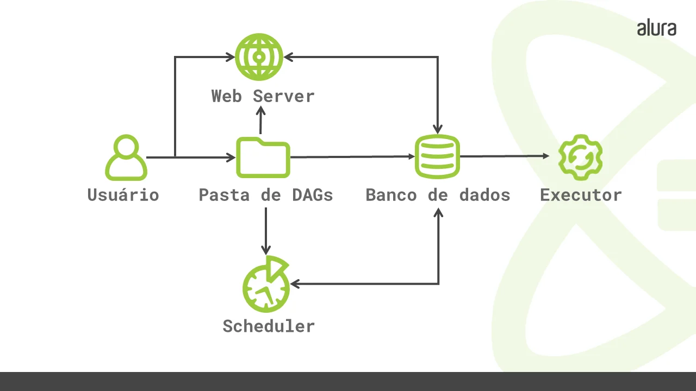

Um pipeline de dados, ou datapipeline, é uma série de etapas de processamento de dados. Sendo que, cada etapa fornece uma saída que é a entrada para a próxima etapa. Isso vai acontecendo até que o pipeline seja concluído. Além disso, também podem existir etapas independentes a serem executadas em paralelo

A maioria dos pipelines possuem três elementos principais: a origem, uma ou mais etapas de processamento e o destino. Mas os pipelines de dados podem ser arquitetados de várias maneiras diferentes e tudo vai depender do caso de uso por meio das **DAGs**, **orquestração de pipeline** e **VMs** 

- **Directed Acyclic Graph DAG (Gráfico Acíclico Direcionado)**: Define as regras do que será efetivamente orquestrado no seu pipeline, refletindo suas relações e dependências, sendo sua sigla: Grafos para a conexão dos nós; Direcionado indicando que o fluxo de trabalho se dá apenas em uma direção; e Acíclico: significa que a execução não entrará em um laço de repetição

- **Virtual Machine VM**: 

[](https://www.stonebranch.com/blog/automate-big-data-pipelines-centralized-orchestration)

Será necessário definir 

## Apache Airflow

Ferramenta open source, escrita em Python, criada pelo Airbnb em 2014 e atualmente faz parte da Apache Software Foundation. Trata-se de um orquestrador de fluxos, ou seja, nos permite decidir em qual momento e em quais condições nosso programa irá rodar. É utilizada principalmente para criação, monitoramento e agendamento de pipeline de dados de forma programática

Contém algumas bibliotecas que só funcionam no Linux. Dessa forma, soluções alternativas para usuários(as) de Windows, como máquinas virtuais ou Docker, são necessárias para uso totalmente funcional dessa ferramenta

- **Task (tarefa)**: Unidade mais básica de um DAG, usada para implementar uma determinada lógica na pipeline, são definidos pela instanciação de um **Operator**
-**DAG ou Job (trabalho)**: Conjunto de tarefas
- **Operators (operadores)**: Blocos de construção de um DAG, contendo a lógica de como os dados são processados em uma data pipeline, sendo classes Python por de baixo dos panos. Quando uma instância de um Operator é criado em um DAG com os parâmetros necessários, essa instânca do Operator passa a ser uma Task. Caso nõ exista um operador para seu caso de uso, é possível criar o seu próprio

Um Operador possui 3 características principais:

- Idempotência: independentemente de quantas vezes uma tarefa for executada com os mesmos parâmetros, o resultado final deve ser sempre o mesmo
- Isolamento: a tarefa não compartilha recursos com outras tarefas de qualquer outro operador
- Atomicidade: a tarefa é um processo indivisível e bem determinado

[](https://www.alura.com.br/artigos/executores-airflow-tipos-funcoes)
######<center>Diagrama do Airflow</center>

O Airflow possui 4 componentes principais que devem estar em execução para que ele funcione corretamente:

- **Web Server**: Servidor feito em Flask, por onde é acessado sua interface. Permite inspecionar, acionar e acompanhar o comportamento dos DAGs e suas tarefas
- **Pasta de arquivos DAG**: armazena os arquivos DAGs criados. Ela é lida pelo agendador e executor
- **Scheduler (agendador)**: Responsável pelo agendamento da execução das tarefas dos DAGs, então ele determina quais tarefas serão realizadas, onde serão executadas e em qual ordem isso acontecerá para o executor
- **Banco de Dados**: Serve para armazenar todos os metadados referentes aos DAGs e suas tarefas. Sendo assim, ele registra o horário em que as tarefas foram executadas, quanto tempo cada task levou para ser realizada e o estado de cada uma - se foram executadas com sucesso ou falha, e outras informações relacionadas
- **Executor**: Mecanismo de execução das tarefas. Ou seja, ele é responsável por descobrir quais recursos serão necessários para executar essas tasks. Possui vários executores, mas somente um é utilizado por vez

Um exemplo de componente situacional seria:

- **Worker**: Processo que executa as tarefas conforme definido pelo executor. Dependendo do executor escolhido, você pode ou não ter workers (trabalhadores) como parte da infraestrutura do Airflow.

### Meu Primeiro DAG Airflow

```py linenums="1"
from airflow.models import DAG
import pendulum
from airflow.operators.empty import EmptyOperator
from airflow.operators.bash import BashOperator

with DAG(
    'meu_primeiro_dag',
    start_date=pendulum.today('UTC').add(days=-N),
    schedule_interval='@daily'
) as dag:
    tarefa_1 = EmptyOperator(task_id = 'tarefa_1')
    tarefa_2 = EmptyOperator(task_id = 'tarefa_2')
    tarefa_3 = EmptyOperator(task_id = 'tarefa_3')
    tarefa_4 = BashOperator(
        task_id = 'cria_pasta',
        bash_command = 'mkdir -p "home/millenagena/Documents/airflowalura/pasta" '
    )
        
    tarefa_1 >> [tarefa_2, tarefa_3]
    tarefa_3 >> tarefa_4
```

<br>

## Azure Data Factory

Solução paga para orquestração de data pipelines da Microsoft, estando integrada com seus outros serviços

<br>

## AWS Glue

Integrado também com as soluções da Amazon

## Google Cloud Composer


