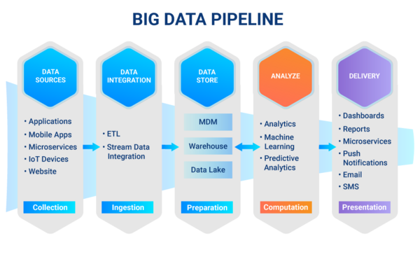

Um pipeline de dados, ou datapipeline, é uma série de etapas de processamento de dados. Sendo que, cada etapa fornece uma saída que é a entrada para a próxima etapa. Isso vai acontecendo até que o pipeline seja concluído. Além disso, também podem existir etapas independentes a serem executadas em paralelo

A maioria dos pipelines possuem três elementos principais: a origem, uma ou mais etapas de processamento e o destino. Mas os pipelines de dados podem ser arquitetados de várias maneiras diferentes e tudo vai depender do caso de uso por meio das **DAGs**, **orquestração de pipeline** e **VMs** 

- **Directed Acyclic Graph DAG**: Define as regras do que será efetivamente orquestrado no seu pipeline, refletindo suas relações e dependências e, como o próprio nome sugere, é direto sem loops

- **Virtual Machine VM**: 

Será necessário definir 

### Apache Airflow

Ferramenta open source, escrita em Python, criada pelo Airbnb em 2014 e atualmente faz parte da Apache Software Foundation. Trata-se de um orquestrador de fluxos, ou seja, nos permite decidir em qual momento e em quais condições nosso programa irá rodar. É utilizada principalmente para criação, monitoramento e agendamento de pipeline de dados de forma programática

Contém algumas bibliotecas que só funcionam no Linux. Dessa forma, soluções alternativas para usuários(as) de Windows, como máquinas virtuais ou Docker, são necessárias para uso totalmente funcional dessa ferramenta

Um **Task (tarefa)** é a unidade mais básica de um DAG, usada para implementar uma determinada lógica na pipeline, são definidos pela instanciação de um **Operator**

Os **Operators (operadores**) são os blocos de construção de um DAG, contendo a lógica de como os dados são processados em uma data pipeline

######
Deploy básico no Airflow

 

### Azure Data Factory

Solução paga para orquestração de data pipelines da Microsoft, estando integrada com seus outros serviços

 

### AWS Glue

Integrado também com as soluções da Amazon

## Google Cloud Composer

