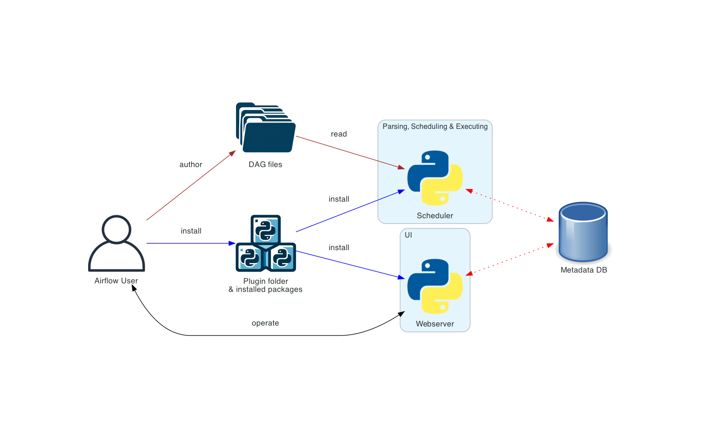

São orquestradores de Data Pipelines, gerenciando todo o fluxo dos dados, garantindo que as etapas desde a coleta dos dados até a etapa final da solução estejam sendo executadas com diversos monitoramentos por meio das **DAGs**

- **DAG Directed Acyclic Graph**: Define as regras do que será efetivamente orquestrado no seu pipeline, refletindo suas relações e dependências e, como o próprio nome sugere, é direto sem loops

Será necessário definir 

### Apache Airflow

Solução grátis e open source 

######
Deploy básico no Airflow

 

### Azure Data Factory

Solução paga para orquestração de data pipelines da Microsoft, estando integrada com seus outros serviços

 

### AWS Glue

Integrado também com as soluções da Amazon

## Google Cloud Composer

